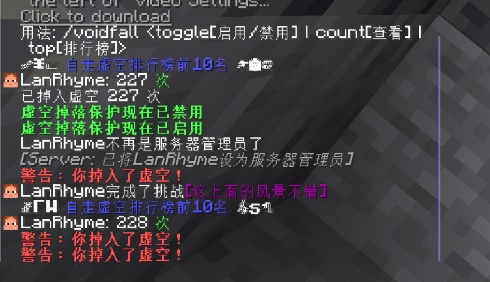

# VoidFallProtection

VoidFallProtection 是一个用于 Minecraft 服务器的插件，旨在保护玩家免受虚空掉落造成的伤害

当玩家掉入虚空区域时，插件会自动记录掉落次数，并给予漂浮和缓降效果以保护玩家

适用于1.20及以上版本的paper服务端

## 功能特点
- 防止受到虚空的伤害
- 可以自由选择开启或关闭阻止掉落虚空功能
- 在玩家掉入虚空时给予警告
- 记录玩家掉入虚空的次数
- 生成自走虚空排行榜ヾ(•ω•`)o

## 安装指南
1. 确保你的服务器正在运行 Paper 或兼容的 Spigot 服务器
2. 将 `VoidFallProtection.jar` 文件放入服务器的 `plugins` 文件夹
3. 重启服务器以加载插件
4. 插件将自动在服务器启动时创建配置文件
- 应该都会吧...(我README是用ai生成的

## 使用说明
- 使用 `/voidfall` 命令来查看插件的帮助信息
- 使用 `/voidfall top` 命令来查看掉落次数排行榜
- 使用 `/voidfall toggle` 命令来启用或禁用阻止掉落虚空功能
## 配置文件
插件会在第一次启动时在 `plugins/VoidFallProtection` 文件夹中创建 `config.yml` 文件，你可以在这个文件中调整插件设置

## 命令权限
- `voidfall.use` - 允许使用 `/voidfall` 命令

## 支持与反馈
如果你在使用过程中遇到任何问题，或者有任何建议，请通过以下方式联系我们：
- [GitHub Issue Tracker](https://github.com/LanRhyme/VoidFallProtectionPlugin/issues)
- 虽然我基本都会看，但我很摆，所以别指望(

